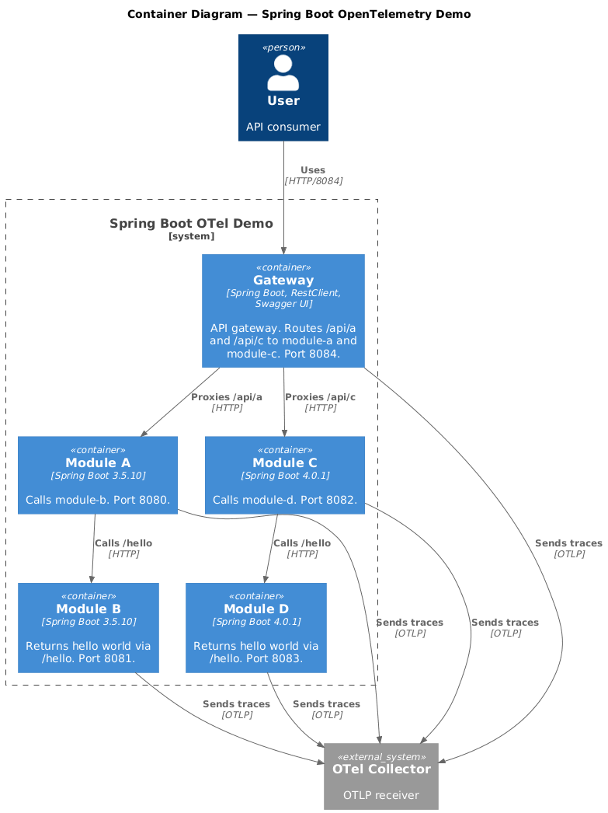

# Spring Boot OpenTelemetry Honeycomb Example

A multi-module Spring Boot POC demonstrating OpenTelemetry tracing with Honeycomb and Jaeger. Two stacks are available: **sb35x** (Spring Boot 3.5.x) with module-a calling module-b, and **sb4x** (Spring Boot 4.x) with module-c calling module-d. All traces flow through the OpenTelemetry Collector to Jaeger (local) and optionally to Honeycomb (cloud).



## How to run in local

Build and start all services (sb35x and sb4x):

```bash
docker compose up --build -d
http://localhost:8084/swagger-ui.html
```

Services will be available at:

- **gateway** (API Gateway): http://localhost:8084 – routes /api/a and /api/c
- **Swagger UI (API docs)**: http://localhost:8084/swagger-ui.html
- **module-a** (sb35x): http://localhost:8080
- **module-b** (sb35x): http://localhost:8081 (for debugging)
- **module-c** (sb4x): http://localhost:8082
- **module-d** (sb4x): http://localhost:8083 (for debugging)
- **Jaeger UI**: http://localhost:16686

## Call the Services

**Via API Gateway (recommended):**

```bash
curl http://localhost:8084/api/a
curl http://localhost:8084/api/c
```

**Automated test** (asserts both return `hello world`):

```bash
./test-gateway.sh          # assumes stack is already running
./test-gateway.sh --up     # starts docker compose first, then tests
```
